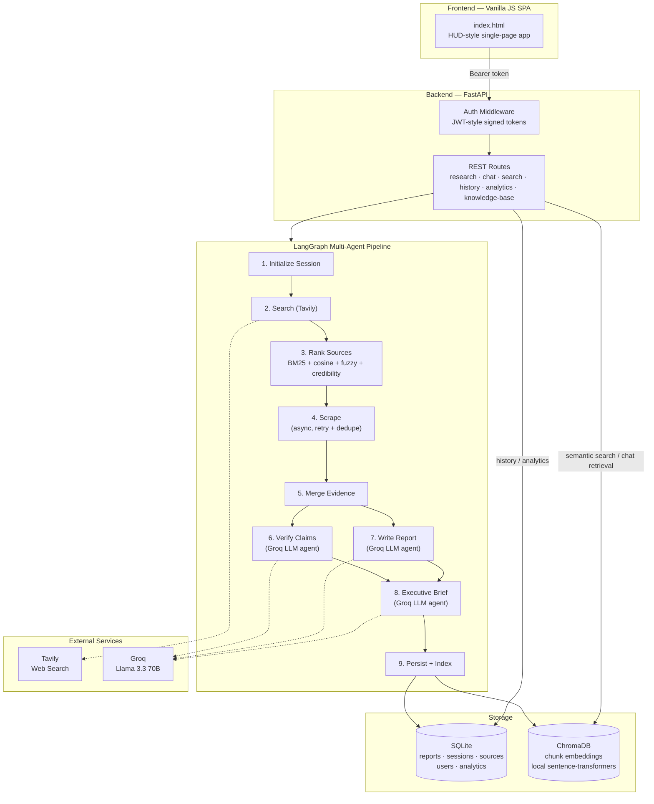

<div align="center">

*Atlas AI · Case files built, not chats answered.*

</div><div align="center">

#  Atlas

### *Atlas isn't where research ends. It's where knowledge lives.*

**A Living Research Workspace that transforms research into structured, verifiable, and evolving Living Cases.**

[]()
[]()
[]()
[]()
[]()

</div>

---


# Overview

Atlas is an AI-powered **Living Research Workspace** designed to help users navigate complex information with confidence.

Unlike traditional AI assistants that generate one-time answers, Atlas organizes every investigation into a **Living Case**—a structured knowledge asset that combines evidence, source verification, confidence analysis, semantic memory, and long-term retrieval.

Every research session becomes traceable, searchable, and reusable.

---

# Why Atlas?

Modern AI tools generate answers.

Atlas generates **knowledge**.

Instead of producing isolated conversations, Atlas builds persistent research cases that preserve:

- Questions
- Sources
- Evidence
- Claims
- Confidence
- Research history
- Semantic memory

Every conclusion remains traceable back to its supporting evidence.

---

# Core Features

## Living Cases

Transform every research query into a structured research case containing:

- Research question
- Executive summary
- Supporting evidence
- Source citations
- Confidence score
- Retrieved documents
- Generated report
- Semantic embeddings

---

## Intelligent Research Pipeline

Atlas performs an end-to-end research workflow:



---

## Semantic Memory

Research doesn't disappear after generation.

Atlas stores reports inside ChromaDB, enabling:

- Semantic search
- Similar case retrieval
- Knowledge reuse
- Context-aware follow-up questions

---

## Knowledge Navigation

Atlas treats research as a navigable landscape rather than isolated outputs.

Users can:

- Explore previous cases
- Compare findings
- Trace supporting evidence
- Navigate related research
- Continue previous investigations

---

## Source Verification

Every report includes:

- Source attribution
- Evidence mapping
- Confidence scoring
- Citation tracking

This creates transparent and explainable AI-generated research.

---

## Analytics Dashboard

Monitor research activity through:

- Total research cases
- Average confidence
- Knowledge base growth
- Source distribution
- Retrieval statistics

---

# Tech Stack

## Backend

- FastAPI
- Python
- LangGraph
- LangChain
- Groq LLM
- ChromaDB
- SQLite

---

## AI & NLP

- Retrieval-Augmented Generation (RAG)
- Semantic Search
- Embeddings
- Agentic Workflows
- Prompt Engineering

---

## Frontend

- Vanilla JS

## APIs

- Tavily Search API
- Groq API

---

# Project Structure

```
Atlas/

backend/
│
├── api/
├── agents/
├── services/
├── models/
├── database/
├── vector_store/
└── main.py

frontend/
│
├── streamlit_app.py
├── design_system.py
├── utils.py
└── pages/

requirements.txt

README.md
```

---

# Running Locally

## Clone

```bash
git clone https://github.com/shreyajoshi144/atlas.git

cd atlas
```

---

## Create Virtual Environment

```bash
python -m venv .venv
```

Activate

Mac/Linux

```bash
source .venv/bin/activate
```

Windows

```bash
.venv\Scripts\activate
```

---

## Install Dependencies

```bash
pip install -r requirements.txt
```

---

## Configure Environment

Create

```
.env
```

Example

```env
GROQ_API_KEY=YOUR_KEY
TAVILY_API_KEY=YOUR_KEY
```

---

## Start Backend

```bash
cd backend

uvicorn main:app --reload
```

---

## Start Frontend

```bash
cd frontend

streamlit run streamlit_app.py
```

---

# Future Roadmap

- Living Knowledge Graph
- Knowledge Evolution Engine
- Versioned Living Cases
- Perspective-based reports
- Case comparison
- Multi-user collaboration
- PDF & PowerPoint export
- Real-time research monitoring
- Case branching & merging

---


### Atlas

*"Every investigation becomes a Living Case. Every conclusion earns its confidence."*

</div>
