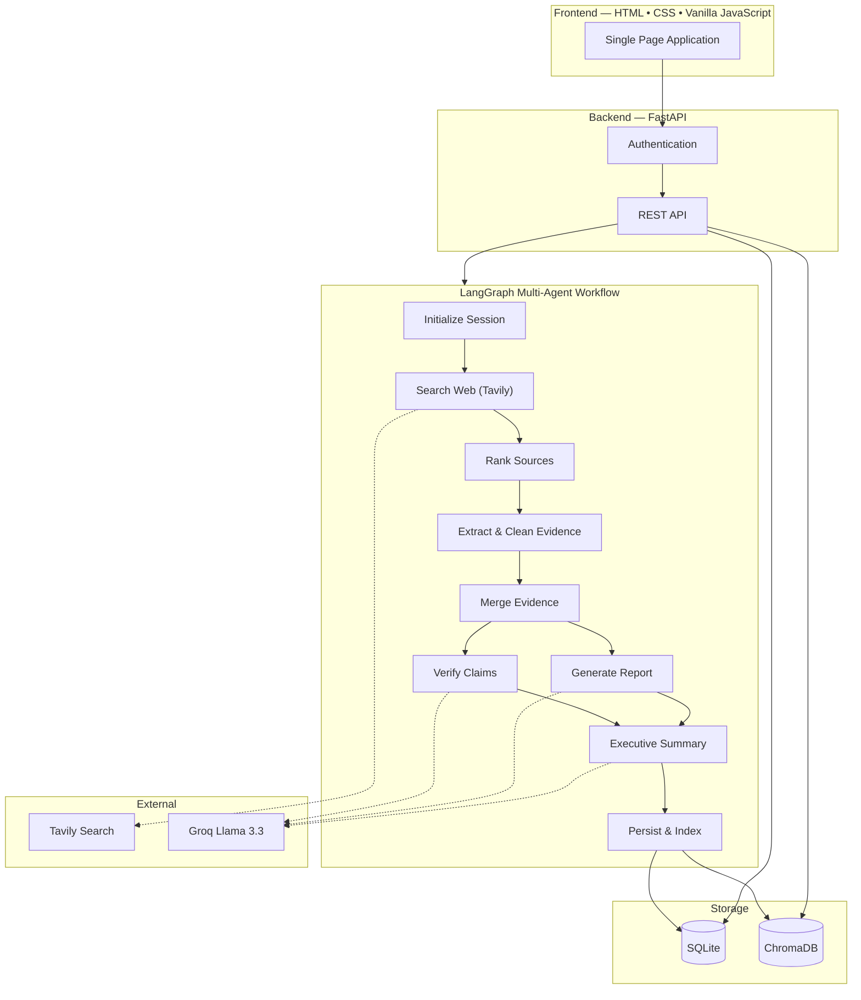

<div align="center">

# Atlas

### *Atlas isn't where research ends. It's where knowledge lives.*

**An AI-powered Living Research Workspace that transforms web research into structured, verifiable, and evolving Living Cases.**

Rather than generating one-time answers, Atlas builds persistent knowledge assets that preserve evidence, citations, confidence scores, semantic memory, and research history—allowing every investigation to grow over time.


</div>

---
# Demo Screenshots


# Overview

Atlas is an AI-powered research operating system that transforms web research into structured, reusable knowledge.

Unlike traditional AI assistants that generate isolated conversations, Atlas creates **Living Cases**—persistent research workspaces that combine:

* Research questions
* Verified evidence
* Source citations
* Executive summaries
* AI-generated reports
* Confidence analysis
* Semantic memory
* Long-term retrieval

Every investigation becomes a searchable knowledge asset instead of a forgotten chat.

---

# Why Atlas?

Most AI assistants answer questions.

**Atlas builds knowledge.**

Traditional chatbots lose context once a conversation ends.

Atlas preserves every investigation as a Living Case, enabling users to:

* Revisit previous research
* Continue unfinished investigations
* Compare findings across cases
* Verify supporting evidence
* Retrieve related knowledge semantically
* Build a growing personal knowledge base

Every conclusion remains transparent, explainable, and backed by evidence.

---

# Key Features

## Living Cases

Every research session is transformed into a persistent knowledge object containing:

* Research question
* Executive summary
* AI-generated report
* Supporting evidence
* Verified claims
* Source citations
* Confidence score
* Retrieved documents
* Semantic embeddings

---

## Multi-Agent Research Pipeline

Atlas orchestrates multiple AI agents that collaborate to perform end-to-end research.

Specialized agents handle:

* Web Search
* Source Ranking
* Evidence Extraction
* Claim Verification
* Report Generation
* Executive Brief Creation
* Semantic Indexing

---

## Semantic Memory

Research doesn't disappear after generation.

Atlas stores reports inside ChromaDB, enabling:

* Semantic search
* Related case retrieval
* Long-term knowledge retention
* Context-aware follow-up questions
* Knowledge reuse across investigations

---

## Explainable AI

Every conclusion is traceable back to supporting evidence.

Each report includes:

* Source attribution
* Citation tracking
* Confidence scoring
* Evidence mapping
* Transparent reasoning

---

## Analytics Dashboard

Monitor research activity through:

* Total research cases
* Knowledge base growth
* Average confidence score
* Source distribution
* Retrieval statistics

---

# Research Pipeline



---

# System Architecture

```
Frontend (HTML/CSS/JavaScript)
            │
            ▼
     FastAPI REST API
            │
            ▼
 LangGraph Multi-Agent Workflow
            │
            ▼
Search → Ranking → Verification → Report Generation
            │
            ▼
SQLite + ChromaDB
            │
            ▼
Semantic Search & Knowledge Retrieval
```

---

# Tech Stack

## AI & Agentic Systems

* LangGraph
* LangChain
* Retrieval-Augmented Generation (RAG)
* Prompt Engineering
* Sentence Transformers

## Backend

* Python 3.11+
* FastAPI
* AsyncIO
* Pydantic

## Frontend

* HTML5
* CSS3
* Vanilla JavaScript (ES6)
* Fetch API

## Search & Intelligence

* Tavily Search API
* BM25 Ranking
* Cosine Similarity
* Fuzzy Matching

## Vector Database

* ChromaDB

## Database

* SQLite

## Large Language Model

* Groq
* Llama 3.3 70B

---

# Project Structure

```text
Atlas/
│
├── backend/
│   ├── agents/
│   ├── api/
│   ├── database/
│   ├── models/
│   ├── services/
│   ├── vector_store/
│   └── main.py
│
├── frontend/
│   ├── index.html
│   ├── css/
│   ├── js/
│   ├── assets/
│   └── components/
│
├── requirements.txt
├── .env.example
└── README.md
```

---

# Getting Started

## Clone the Repository

```bash
git clone https://github.com/shreyajoshi144/atlas.git

cd atlas
```

---

## Create a Virtual Environment

```bash
python -m venv .venv
```

### macOS / Linux

```bash
source .venv/bin/activate
```

### Windows

```bash
.venv\Scripts\activate
```

---

## Install Dependencies

```bash
pip install -r requirements.txt
```

---

## Configure Environment Variables

Create a `.env` file.

```env
GROQ_API_KEY=your_groq_api_key
TAVILY_API_KEY=your_tavily_api_key
```

---

## Run the Backend

```bash
cd backend

uvicorn main:app --reload
```

Backend runs at:

```
http://localhost:8000
```

---

## Run the Frontend

Open the frontend using a local server.

```bash
cd frontend

python -m http.server 5500
```

Visit:

```
http://localhost:5500
```

---

# REST API

| Method | Endpoint          | Description               |
| ------ | ----------------- | ------------------------- |
| POST   | `/research`       | Create a new Living Case  |
| POST   | `/chat`           | Continue an existing case |
| GET    | `/search`         | Semantic knowledge search |
| GET    | `/history`        | Retrieve previous cases   |
| GET    | `/analytics`      | Research analytics        |
| GET    | `/knowledge-base` | Browse stored research    |

---

# Future Roadmap

* Versioned Living Cases
* Perspective-Based Reports
* Case Comparison
* Case Branching & Merging
* Multi-User Collaboration
* Team Workspaces
* Citation Graph Visualization
* PDF & PowerPoint Export
* Real-Time Research Monitoring

