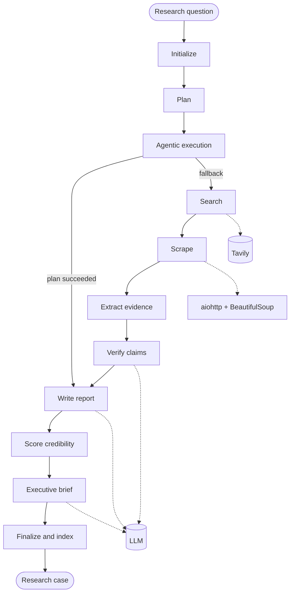
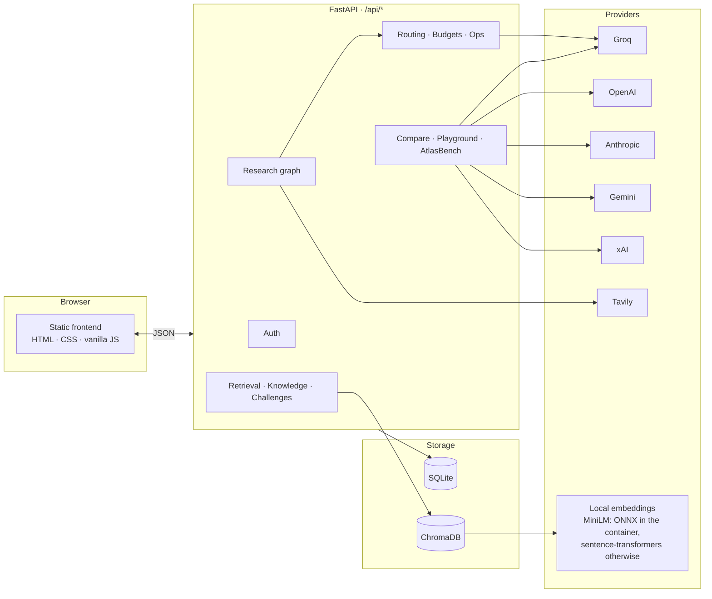

# Atlas

**Research you can trace. AI you can measure.**

Atlas is a research workspace that keeps the process alongside the result. You ask a question and Atlas finds and ranks sources, builds an evidence set, checks claims against it, and writes a structured report. Every claim stays linked to the source it came from. Atlas also gives you tools to test the models behind that research: side-by-side comparison across four providers, a reproducible benchmark, and cost-aware model routing. It ranks models only on measured results, never on opinion.

```
Question → Sources → Evidence → Verification → Report → Knowledge
```

Built with FastAPI, LangGraph, SQLite, ChromaDB and a dependency-free static frontend. **Live demo:** https://atlas-cite-check.onrender.com (free tier: the first request after idle can take about a minute, and data resets when the app restarts; see [Deployment](#deployment)).

---

## Contents

- [Features](#features)
- [How a research run works](#how-a-research-run-works)
- [Architecture](#architecture)
- [Quick start](#quick-start)
- [Configuration](#configuration)
- [Comparing and evaluating models](#comparing-and-evaluating-models)
- [Deployment](#deployment)
- [Testing](#testing)
- [Project layout](#project-layout)
- [Security](#security)
- [Project status](#project-status)
- [Documentation](#documentation)

---

## Features

### Research

| Feature | What it does |
| --- | --- |
| **Research pipeline** | A LangGraph workflow that plans, searches, scrapes, extracts evidence, verifies claims, writes the report, scores credibility and produces an executive brief. |
| **Agentic planning** | Validated plans run over a closed tool registry, with bounded re-planning when verification fails. If planning fails, the run falls back to the fixed pipeline. |
| **Source ranking** | Combines BM25, TF-IDF, cosine similarity and RapidFuzz signals. Relevance is scored separately from credibility (domain reputation, freshness, corroboration). |
| **Claim verification** | Each claim is labelled *supporting*, *uncertain* or *conflicting* and stays linked to the evidence behind it. No single unexplained confidence score. |
| **Hybrid retrieval** | Searches past research using BM25 and dense embeddings, merged with reciprocal-rank fusion, then reranked, with metadata filters. |
| **Knowledge Map** | Extracts entities and claims into a per-user graph, with change tracking and source-freshness signals. |
| **Challenge mode** | Runs deterministic adversarial queries that try to break a finding before you rely on it. |
| **Notes, questions and chat** | Follow-up chat grounded in your stored research, plus notes and open questions attached to each case. |

### Model evaluation and control

| Feature | What it does |
| --- | --- |
| **Compare** | Sends one question to OpenAI, Anthropic, Google Gemini and xAI Grok models. Each answer shows its citations, token usage, estimated cost, latency, retries and failures. |
| **Playground** | Compares up to three allowlisted Groq models side by side over your research library, with optional Tavily web search. |
| **AtlasBench** | Reproducible benchmark runs on frozen tasks and gold evidence. Arbitration compares only completed outputs scored against the same task. There is no LLM judge. |
| **Routing and Cost Autopilot** | Policy-based model selection with production fallback chains, managed on the **Routing & cost** tab inside AtlasBench. It sits behind `core.llm`, so agent code doesn't change. |
| **Budgets** | Per-user daily call limits and a monthly spend cap. Unknown model pricing is blocked when a cap is set. |
| **Operations** | Admin endpoints for operational controls and monitoring. |

---

## How a research run works


```mermaid
flowchart TD
    Q([Research question]) --> I[Initialize]
    I --> P[Plan]
    P --> X[Agentic execution]
    X -->|plan succeeded| W
    X -->|fallback| S[Search]
    S --> SC[Scrape]
    SC --> E[Extract evidence]
    E --> V[Verify claims]
    V --> W[Write report]
    W --> C[Score credibility]
    C --> B[Executive brief]
    B --> F[Finalize and index]
    F --> D([Research case])

    S -.-> T[(Tavily)]
    SC -.-> H[aiohttp + BeautifulSoup]
    V -.-> L[(LLM)]
    W -.-> L
    B -.-> L
```

Deterministic code handles ranking and credibility. The LLM is used only where language understanding is required. When the report is finished, it's stored in SQLite as structured data and split into chunks in ChromaDB, so later searches can find it by meaning rather than exact wording.

If the writer returns malformed or truncated structured output, Atlas makes one bounded recovery call that keeps the evidence intact. If that also fails, Atlas reports a clear error instead of guessing at the repair.

---

## Architecture


```mermaid
flowchart LR
    subgraph Browser
        UI["Static frontend<br/>HTML · CSS · vanilla JS"]
    end

    subgraph API["FastAPI · /api/*"]
        AUTH[Auth]
        RES[Research graph]
        RET[Retrieval · Knowledge · Challenges]
        EVAL[Compare · Playground · AtlasBench]
        ROUTE[Routing · Budgets · Ops]
    end

    subgraph Storage
        SQL[(SQLite)]
        VEC[(ChromaDB)]
    end

    subgraph Providers
        GROQ[Groq]
        OAI[OpenAI]
        ANT[Anthropic]
        GEM[Gemini]
        XAI[xAI]
        TAV[Tavily]
        EMB[Local embeddings<br/>MiniLM: ONNX in the container,<br/>sentence-transformers otherwise]
    end

    UI <-->|JSON| API
    RES --> ROUTE --> GROQ
    EVAL --> OAI & ANT & GEM & XAI & GROQ
    RES --> TAV
    API --> SQL
    RET --> VEC --> EMB
```

**Why two stores?** The data is accessed in two different ways. SQLite holds structured records such as users, sessions, reports, source scores, budgets and benchmark runs. ChromaDB holds embedded report chunks for semantic search. Neither duplicates the other.

---

## Quick start

**Requirements:** Python 3.11 or newer (tested on 3.13), plus API keys for [Groq](https://console.groq.com) and [Tavily](https://tavily.com). Node.js is optional and only needed for the frontend checks.

```sh
git clone https://github.com/shreyajoshi144/atlas.git
cd atlas

python3 -m venv .venv
source .venv/bin/activate
pip install -r requirements.txt        # add -r requirements-dev.txt to run the tests

cp .env.example .env
# edit .env: set GROQ_API_KEY, TAVILY_API_KEY and a random SECRET_KEY (32+ chars)

python start.py
```

`start.py` starts one server (set `PORT` to change the port; the default is 7860) that serves both:

| Service | URL |
| --- | --- |
| Frontend | http://127.0.0.1:7860 (landing page) · `/auth.html` · `/app.html` |
| API | http://127.0.0.1:7860/api · health checks at `/health` and `/ready` · OpenAPI docs at `/docs` (development only; off in production unless `ENABLE_API_DOCS=true`) |

On first start, Atlas creates the SQLite schema and applies additive migrations. Embeddings run locally by default, so `OPENAI_API_KEY` is optional.

---

## Configuration

All settings are read from `.env`. `.env.example` lists every option, and `backend/core/config.py` defines the full set.

| Variable | Required | Purpose |
| --- | --- | --- |
| `GROQ_API_KEY` | Yes | Default LLM provider for the research pipeline and Playground |
| `TAVILY_API_KEY` | Yes | Web search |
| `SECRET_KEY` | Yes | Token signing secret, at least 32 random characters |
| `APP_ENV` | No | `development` (default), `staging` or `production` |
| `CORS_ALLOWED_ORIGINS` | Production | Comma-separated list of exact frontend origins, no wildcards |
| `DEFAULT_MONTHLY_LLM_SPEND_CAP_USD` | Production | Monthly budget per user. Startup fails in production without it |
| `GLOBAL_MONTHLY_LLM_SPEND_CAP_USD` | Recommended for public deployments | App-wide monthly ceiling across **all** accounts. Per-user caps multiply with every sign-up; this bounds total spend on your keys |
| `DEFAULT_DAILY_LLM_CALL_LIMIT` | No | Daily LLM calls per user (default `1000`) |
| `OPENAI_API_KEY` / `ANTHROPIC_API_KEY` / `GEMINI_API_KEY` / `XAI_API_KEY` | No | Turns on that provider in Compare. Providers without a key show as not configured |
| `ATLAS_DATA_DIR` | No | Base directory for the SQLite and Chroma data (default `./data`) |
| `SQLITE_PATH` / `CHROMA_PATH` | No | Override the individual store locations |
| `FRONTEND_BASE_URL` | No | Public frontend URL (default `http://localhost:7860`) |
| `ENABLE_API_DOCS` | No | `true` turns the Swagger UI back on in production |
| `ATLAS_EMBEDDING_BACKEND` | No | `onnx` uses the ONNX build of the embedding model (no PyTorch at run time). Set in the Docker image |
| `ATLAS_DENSE_RANKING` | No | `0` ranks sources with keyword and credibility signals only. Set in the Docker image for 512 MB hosts |
| `ATLAS_MAX_TOP_K` | No | Caps the number of sources per research run (the Docker image sets 6) |
| `ATLAS_LIGHT_MODE` | No | `1` skips vector indexing and the executive brief so a run fits a small host. Reports are still saved. Set in the Docker image |
| `DEMO_EMAIL` / `DEMO_PASSWORD` | No | Creates a demo account at every start, so a host that wipes its disk still has a working login |

To run the frontend and API on different origins, set `window.ATLAS_API_BASE` in `frontend/js/config.js`.

---

## Comparing and evaluating models

**Compare** (`/api/compare`) calls the real provider APIs. Model IDs and list prices are stored in `backend/providers/catalog.json`, and each entry has a source URL and the date it was verified. The UI warns when the catalog is more than 60 days old. Admins can call `POST /api/compare/admin/discover` to check the catalog against the models their keys can actually use. Costs are estimates, not invoices.

**Evaluation** is the only basis Atlas uses to say one model is better than another:

```sh
# preview worst-case spend first
python -m backend.providers.eval_cli --models openai:gpt-6.1-sol,anthropic:claude-sonnet-5-5 --max-usd 2 --dry-run

# run the 24-case grounding / abstention / prompt-injection / structured-output suite
python -m backend.providers.eval_cli --models openai:gpt-6.1-sol,anthropic:claude-sonnet-5-5 --max-usd 2
```

The Compare page shows the results with confidence intervals. It reports a ranking only when those intervals don't overlap. No results ship pre-computed.

---

## Deployment

The `Dockerfile` builds one container for any Docker host. The live demo runs it on the **Render** free tier; the same image also fits a Hugging Face Docker Space (a paid feature):

- Non-root user `uid 1000`, port `7860`, health check on `/ready`
- The ONNX embedding model is downloaded at build time, so start-up needs no network
- The image sets `ATLAS_EMBEDDING_BACKEND=onnx`, `ATLAS_DENSE_RANKING=0`, `ATLAS_MAX_TOP_K=6` and `ATLAS_LIGHT_MODE=1` so research fits in 512 MB of memory
- `deploy/space_app.py` serves the API and the static frontend from one origin, so CORS isn't needed
- `deploy/seed_demo.py` creates an optional demo account when `DEMO_EMAIL` and `DEMO_PASSWORD` are set

```sh
docker build -t atlas .
docker run --rm -p 7860:7860 --env-file .env -v atlas-data:/home/user/app/data atlas
# or: docker compose up --build
```

The image runs on both amd64 and arm64. Step-by-step Render and Hugging Face instructions, storage options and constraints are in the [deployment guide](docs/07-deployment.md). On free tiers the disk is wiped at every restart, so set `DEMO_EMAIL` and `DEMO_PASSWORD` and treat other accounts as temporary.

Production checklist: `APP_ENV=production`, a unique `SECRET_KEY`, explicit `CORS_ALLOWED_ORIGINS`, a per-user monthly spend cap, a global monthly spend cap, and secrets kept in the platform's secret store. Promote admin accounts through the database, as described in [`backend/ops/README.md`](backend/ops/README.md).

---

## Testing

```sh
# Python suite: offline provider stubs, real SQLite
python -m pytest -q

# Provider / Compare suite (standard library only, local fake provider server)
python -m unittest discover -s backend/providers/tests -t .

# Frontend: syntax check and UI module tests
for f in frontend/js/*.js; do node --check "$f"; done
for f in backend/tests/js/*.test.js; do node "$f"; done

# Browser end-to-end tests against a mock API
pip install playwright && playwright install chromium
python frontend/tests/e2e/test_frontend_e2e.py
python frontend/tests/e2e/test_compare_e2e.py
```

The suite includes authorization isolation between users, migrations on fresh and legacy schemas, API security, routing and fallback, benchmark recovery, and palette and accessibility checks for the frontend. Passing these tests doesn't prove that live credentials, quotas or network access work; check those separately.

---

## Project layout

```
atlas/
├── main.py                 FastAPI app, routers, exception handling
├── start.py                Local launcher (API + frontend on :7860)
├── backend/
│   ├── api/routes/         HTTP endpoints, one module per area
│   ├── graph/              LangGraph research workflow (state, nodes, edges)
│   ├── agents/             Verification, writer and executive-brief agents
│   ├── agentic/            Planner, tool registry, controlled execution
│   ├── retrieval/          BM25, dense search, fusion, reranking, filters
│   ├── knowledge/          Extraction, Knowledge Map, freshness, change tracking
│   ├── challenges/         Adversarial challenge queries and classification
│   ├── bench/              AtlasBench runner, scoring, arbitration, suites
│   ├── evaluation/         Evaluation datasets and metrics
│   ├── providers/          Compare: provider clients, catalog, eval CLI
│   ├── routing/            Model routing, Cost Autopilot, fallback
│   ├── playground/         Playground persistence
│   ├── ops/                Admin controls and monitoring
│   ├── auth/               Password hashing and token signing
│   ├── database/           SQLite schema, migrations, repositories
│   └── tests/              pytest suites and JS UI tests
├── frontend/               Static pages, CSS tokens, JS modules, e2e tests
├── deploy/                 Single-origin app and container start-up
└── docs/                   Product, architecture, evaluation, testing, operations, and project management (docs/project)
```

---

## Security

- **Passwords** are hashed with Argon2. Existing PBKDF2 hashes still verify, so older accounts keep working.
- **Sessions** use HMAC-SHA256 signed access tokens that expire. Every API area except auth requires a valid token.
- **User data is isolated.** Research, notes, Playground history, benchmark runs and routing policies are scoped to the signed-in user, and tests check this.
- **Provider keys stay on the server.** No endpoint returns them, and they're scrubbed from logs.
- **Errors don't leak.** Unexpected exceptions return the same generic message in every environment. Logs record the path, method and exception type only, never query strings, raw messages or credentials.
- **Spend caps prevent overspending but aren't exact.** They use token-based estimates, so actual billed cost can be higher.

---

## Project status

Atlas is a single-instance application: SQLite and a local ChromaDB on one volume, one worker process. It is suited to a demo, a portfolio deployment or a small team, and not to horizontal scaling. The path to scale (Postgres, a hosted vector store, a shared rate limiter, standard JWTs) is listed in [Architecture](docs/02-architecture.md#9-design-decisions-and-trade-offs).

What has actually been run, and what hasn't, is in [Testing and results](docs/04-testing-and-results.md). Live-provider behaviour needs your own API keys, so no model rankings are bundled. The product scope was deliberately reduced before release; the cut list is in the [decision log](docs/project/07-decision-log.md).

---

## Documentation

| | |
|---|---|
| [Product overview](docs/01-product-overview.md) | What Atlas is and who it's for |
| [Architecture](docs/02-architecture.md) | Diagrams of the pipeline, retrieval, routing, data model, security and deployment |
| [Evaluation](docs/03-evaluation.md) | AtlasBench, the grounding suite, scoring and statistics |
| [Testing and results](docs/04-testing-and-results.md) | What was run, actual results, what was not verified |
| [Development history](docs/05-development-history.md) | Milestones and hardening |
| [Runbook](docs/06-runbook.md) | Operating a deployment |
| [Deployment guide](docs/07-deployment.md) | Render, Docker, Compose and Hugging Face Spaces, step by step |
| [API reference](docs/08-api-reference.md) | Every route, access level and rate limit |
| [Configuration reference](docs/09-configuration.md) | Every environment variable |
| [Changelog](docs/CHANGELOG.md) | What changed, by version |
| [Project management pack](docs/project/README.md) | Charter, requirements (PRD), roadmap, backlog, risk register, QA report, decision log and closure report |
